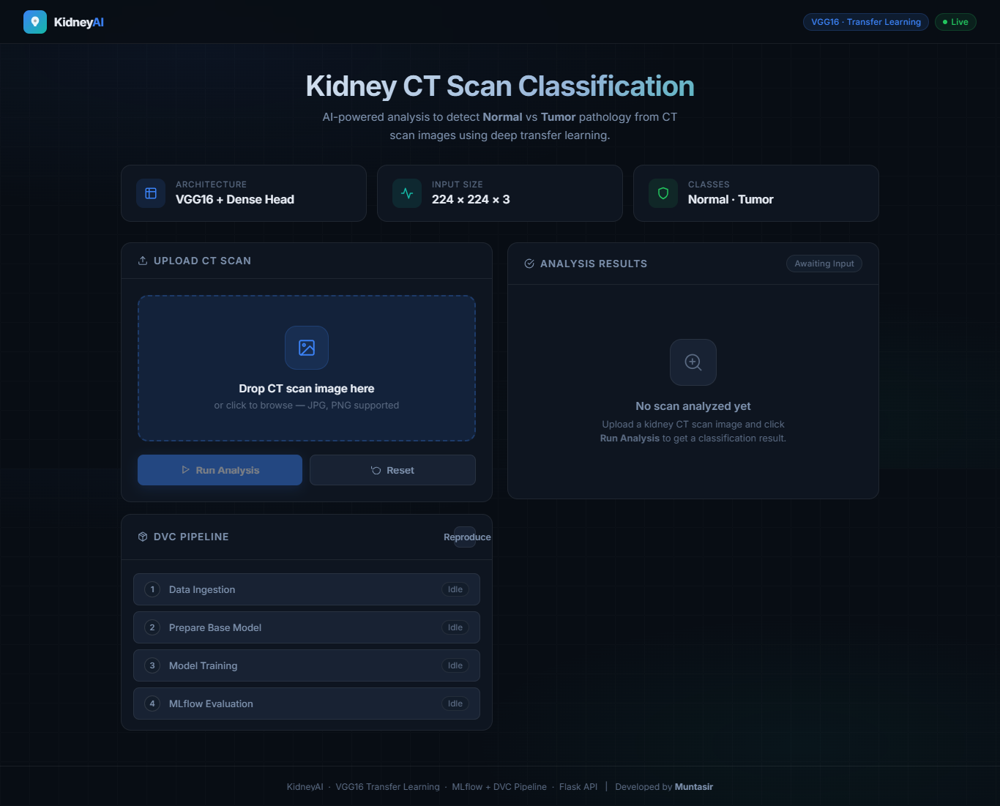
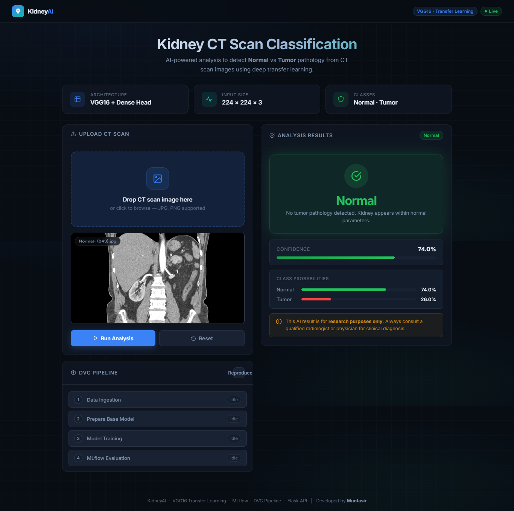
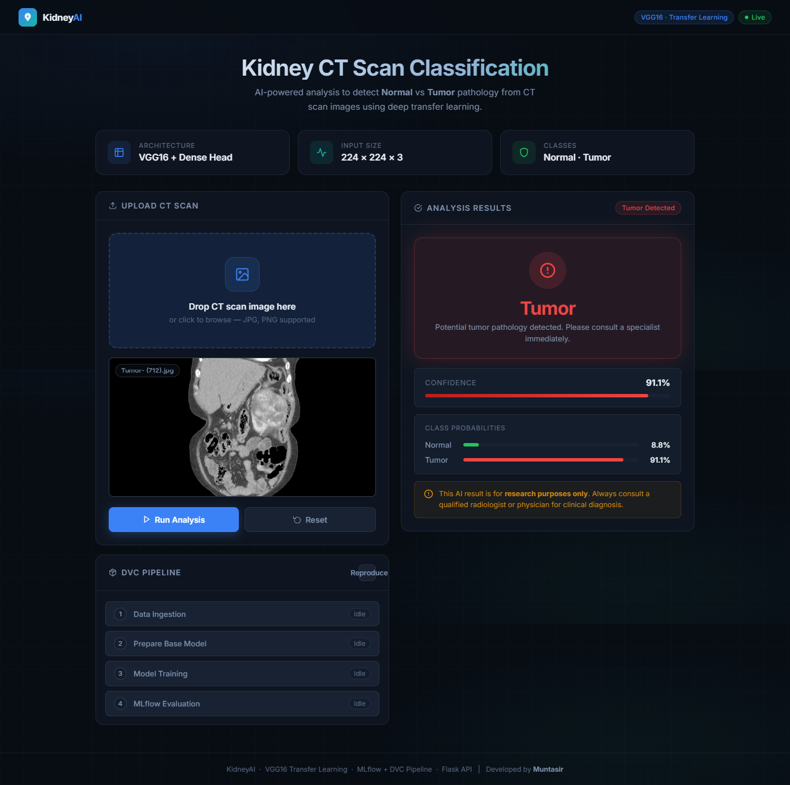

# Kidney Disease Classification

An end-to-end deep learning project for classifying kidney CT scan images into **Normal** and **Tumor** categories using transfer learning (VGG16), with full MLOps integration — MLflow experiment tracking, DVC pipeline orchestration, Flask web API, Docker containerization, and automated AWS CI/CD via GitHub Actions.

---

## Table of Contents

- [Project Overview](#project-overview)
- [Tech Stack](#tech-stack)
- [Screenshots & Demo](#screenshots--demo)
- [Project Structure](#project-structure)
- [Workflows](#workflows)
- [Getting Started](#getting-started)
- [DVC Pipeline](#dvc-pipeline)
- [MLflow Tracking](#mlflow-tracking)
- [Flask Web Application](#flask-web-application)
- [Docker](#docker)
- [AWS CI/CD Deployment](#aws-cicd-deployment)
- [GitHub Secrets Required](#github-secrets-required)

---

## Project Overview

| Detail | Info |
|---|---|
| **Task** | Binary image classification (Normal vs Tumor) |
| **Dataset** | Kidney CT Scan Images (Google Drive) |
| **Model** | VGG16 (pretrained on ImageNet, fine-tuned) |
| **Input Size** | 224 × 224 × 3 |
| **Classes** | Normal, Tumor |
| **Experiment Tracking** | MLflow + DagsHub |
| **Pipeline** | DVC (4-stage DAG) |
| **Serving** | Flask REST API |
| **Deployment** | Docker → AWS ECR → EC2 |

---

## Tech Stack


---

## Screenshots & Demo

### Home Page



### Classifier — Normal Result



### Classifier — Tumor Result



### Full Run Demo

<video src="screenshots/KidneyAI — CT Scan Classifier.mp4" controls width="100%"></video>

> **Note:** If the video does not play inline, [click here to download and view it](screenshots/KidneyAI%20%E2%80%94%20CT%20Scan%20Classifier.mp4).

---

## Project Structure

```
Kidney-Disease-Classification/
│
├── .github/
│   └── workflows/
│       └── main.yaml               # GitHub Actions CI/CD pipeline
│
├── config/
│   └── config.yaml                 # Artifact paths, URLs, MLflow URI
│
├── src/cnnClassifier/
│   ├── __init__.py                 # Logger (stdout + logs/running_logs.log)
│   ├── components/
│   │   ├── data_ingestion.py       # Download + extract dataset (gdown)
│   │   ├── prepare_base_model.py   # VGG16 + custom head
│   │   ├── model_training.py       # ImageDataGenerator + model.fit
│   │   └── model_evaluation_mlflow.py  # Evaluate + log to MLflow
│   ├── config/
│   │   └── configuration.py        # ConfigurationManager
│   ├── constants/
│   │   └── __init__.py             # Config/params file paths
│   ├── entity/
│   │   └── config_entity.py        # Frozen dataclasses for each stage
│   ├── pipeline/
│   │   ├── stage_01_data_ingestion.py
│   │   ├── stage_02_prepare_base_model.py
│   │   ├── stage_03_model_training.py
│   │   ├── stage_04_model_evaluation.py
│   │   └── predict.py              # Inference pipeline (used by Flask)
│   └── utils/
│       └── common.py               # read_yaml, save_json, decodeImage, …
│
├── templates/
│   └── index.html                  # Web UI (drag-and-drop CT scan upload)
│
├── app.py                          # Flask REST API
├── main.py                         # Run all 4 pipeline stages sequentially
├── dvc.yaml                        # DVC pipeline DAG definition
├── dvc.lock                        # DVC reproducibility lock file
├── params.yaml                     # Hyperparameters
├── requirements.txt                # Python dependencies
├── setup.py                        # Installs src/ as local package
├── Dockerfile                      # Container definition
└── template.py                     # Project scaffolding script
```

---

## Workflows

Every new component follows this implementation order:

1. Update `config/config.yaml`
2. Update `params.yaml`
3. Update `src/cnnClassifier/entity/config_entity.py`
4. Update `src/cnnClassifier/config/configuration.py`
5. Implement the component in `src/cnnClassifier/components/`
6. Update the pipeline stage in `src/cnnClassifier/pipeline/`
7. Update `main.py`
8. Update `dvc.yaml`

---

## Getting Started

### 1. Clone the repository

```bash
git clone https://github.com/mars01hash/Kidney-Disease-Classification.git
cd Kidney-Disease-Classification
```

### 2. Create and activate a virtual environment

```bash
# Windows
python -m venv venv
venv\Scripts\activate

# macOS / Linux
python -m venv venv
source venv/bin/activate
```

### 3. Install dependencies

```bash
pip install -r requirements.txt
```

### 4. Set environment variables

```bash
# MLflow / DagsHub credentials
export MLFLOW_TRACKING_URI=https://dagshub.com/<username>/Kidney-Disease-Classification.mlflow
export MLFLOW_TRACKING_USERNAME=<dagshub_username>
export MLFLOW_TRACKING_PASSWORD=<dagshub_token>
```

### 5. Run the full pipeline

```bash
python main.py
```

---

## DVC Pipeline

The pipeline is defined as a 4-stage DAG in `dvc.yaml`:

```
data_ingestion → prepare_base_model → training → evaluation
```

| Stage | Script | Outputs |
|---|---|---|
| `data_ingestion` | `stage_01_data_ingestion.py` | `artifacts/data_ingestion/` |
| `prepare_base_model` | `stage_02_prepare_base_model.py` | `artifacts/prepare_base_model/` |
| `training` | `stage_03_model_training.py` | `artifacts/training/model.h5`, `class_indices.json` |
| `evaluation` | `stage_04_model_evaluation.py` | `scores.json` |

### Run the DVC pipeline

```bash
# Initialize DVC (first time only)
dvc init

# Reproduce the full pipeline (skips unchanged stages)
dvc repro

# View the pipeline DAG
dvc dag
```

### Key hyperparameters (`params.yaml`)

```yaml
IMAGE_SIZE: [224, 224, 3]
BATCH_SIZE: 16
EPOCHS: 1
LEARNING_RATE: 0.01
AUGMENTATION: True
CLASSES: 2
WEIGHTS: imagenet
INCLUDE_TOP: False
```

---

## MLflow Tracking

Experiments are tracked on [DagsHub](https://dagshub.com) via the MLflow protocol.

Each evaluation run logs:
- **Parameters**: all values from `params.yaml`
- **Metrics**: `loss`, `accuracy`
- **Model**: registered as `VGG16Model` in the MLflow Model Registry

The MLflow URI is loaded at runtime from the `MLFLOW_TRACKING_URI` environment variable (defined in `config/config.yaml` as `${MLFLOW_TRACKING_URI}`).

---

## Flask Web Application

### Run locally

```bash
python app.py
# Accessible at http://localhost:8080
```

### API Endpoints

| Method | Route | Description |
|---|---|---|
| `GET` | `/` | Serves the web UI (`index.html`) |
| `GET/POST` | `/train` | Triggers `dvc repro` (requires `ENABLE_TRAINING_ROUTE=true`) |
| `POST` | `/predict` | Accepts a base64-encoded image or multipart file, returns `Normal` or `Tumor` |

### Predict endpoint — request format

**JSON (base64):**
```json
POST /predict
Content-Type: application/json

{ "image": "<base64_encoded_image_string>" }
```

**Response:**
```json
[{ "image": "Normal" }]
```

---

## Docker

### Build the image

```bash
docker build -t kidney-disease-classifier .
```

### Run the container

```bash
docker run -p 8080:8080 \
  -e MLFLOW_TRACKING_URI=<your_mlflow_uri> \
  -e MLFLOW_TRACKING_USERNAME=<username> \
  -e MLFLOW_TRACKING_PASSWORD=<password> \
  kidney-disease-classifier
```

The app will be available at `http://localhost:8080`.

---

## AWS CI/CD Deployment

The GitHub Actions workflow (`.github/workflows/main.yaml`) runs on every push to `main` and executes three jobs:

```
[Integration] → [Build & Push to ECR] → [Deploy to EC2]
```

### Job 1 — Continuous Integration
- Linting and unit tests

### Job 2 — Continuous Delivery
- Configures AWS credentials
- Logs in to Amazon ECR
- Builds the Docker image and pushes it to ECR with the `latest` tag

### Job 3 — Continuous Deployment
- Runs on a **self-hosted runner** (your EC2 instance)
- Pulls the latest image from ECR
- Stops and removes the old container
- Starts the new container on port `8080`
- Cleans up dangling images

### EC2 Setup (self-hosted runner)

1. Launch an EC2 instance (Ubuntu, `t2.medium` recommended)
2. Install Docker: `sudo apt-get install docker.io -y`
3. Register the instance as a GitHub Actions self-hosted runner under:
   `Settings → Actions → Runners → New self-hosted runner`
4. Configure the runner and start it

---

## GitHub Secrets Required

Add these in `Settings → Secrets and variables → Actions`:

| Secret | Description |
|---|---|
| `AWS_ACCESS_KEY_ID` | IAM user access key |
| `AWS_SECRET_ACCESS_KEY` | IAM user secret key |
| `AWS_REGION` | e.g. `us-east-1` |
| `AWS_ECR_LOGIN_URI` | e.g. `123456789.dkr.ecr.us-east-1.amazonaws.com` |
| `ECR_REPOSITORY_NAME` | e.g. `kidney-disease-classifier` |
| `MLFLOW_TRACKING_URI` | DagsHub MLflow tracking URI |
| `MLFLOW_TRACKING_USERNAME` | DagsHub username |
| `MLFLOW_TRACKING_PASSWORD` | DagsHub access token |

---

## Author

**Muntasir** — [muntasir.ais01@gmail.com](mailto:muntasir.ais01@gmail.com)

GitHub: [@mars01hash](https://github.com/mars01hash)
